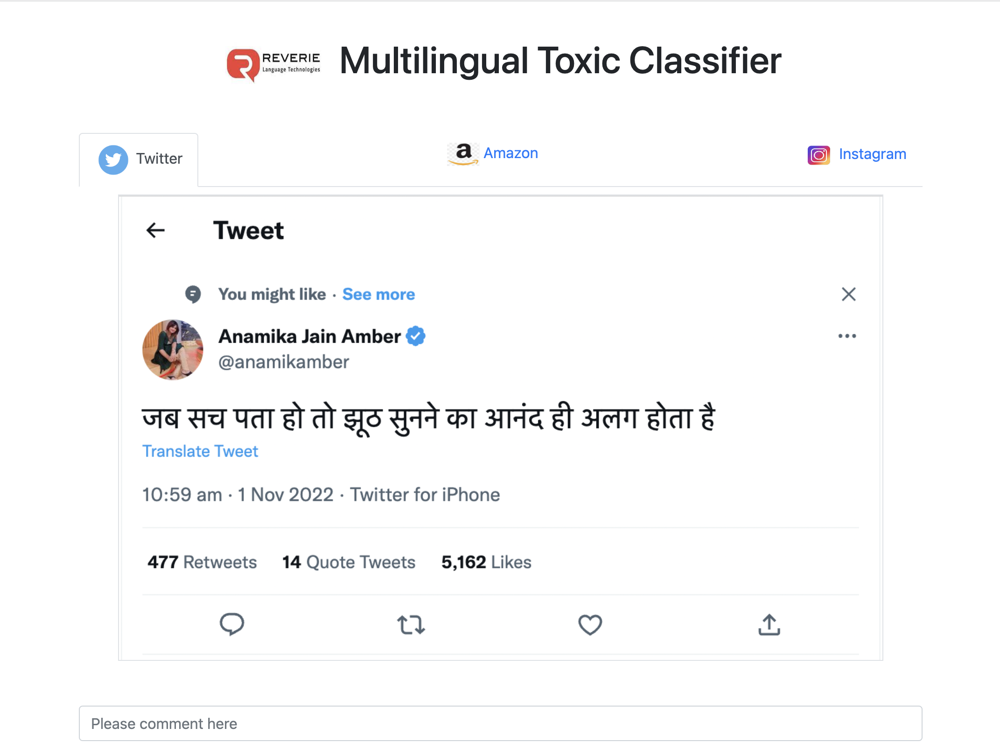

# Toxic-Classifier
Toxic Classifier basically classifies a text as toxic or non-toxic. Since we have tried a binary classification approach, comments which are abusive or insults or hateful are considered as toxic and positive or neutral comments are considered as non-toxic.

We have built an app with 3 different tabs i.e Twitter, Amazon and Instagram demonstrating the usecases where our classification model can be used as shown below.

<p align="center">

</p>

Users can add comments in the text area and predict toxicity of the text.
Along with toxicity, we can detect the language and sentiment of the text as well.

The multilingual model has been trained on English and several Indian languages like Assamese, Bengali, Gujarati, Malayalam, Marathi, Odia, Punjabi, Tamil, Telugu etc.

# How to run

First, install dependencies

```
# clone project

git clone https://github.com/Subhashree-Tripathy/Toxic-Classifier.git

# Go to the repo path and create virtual env

python3 -m venv venv
source venv/bin/activate

# get all the required 
pip install -r requirements.txt

# run the file
python script.py
```

# Staging link

[Click here to view app](http://20.193.172.194:5000/)

